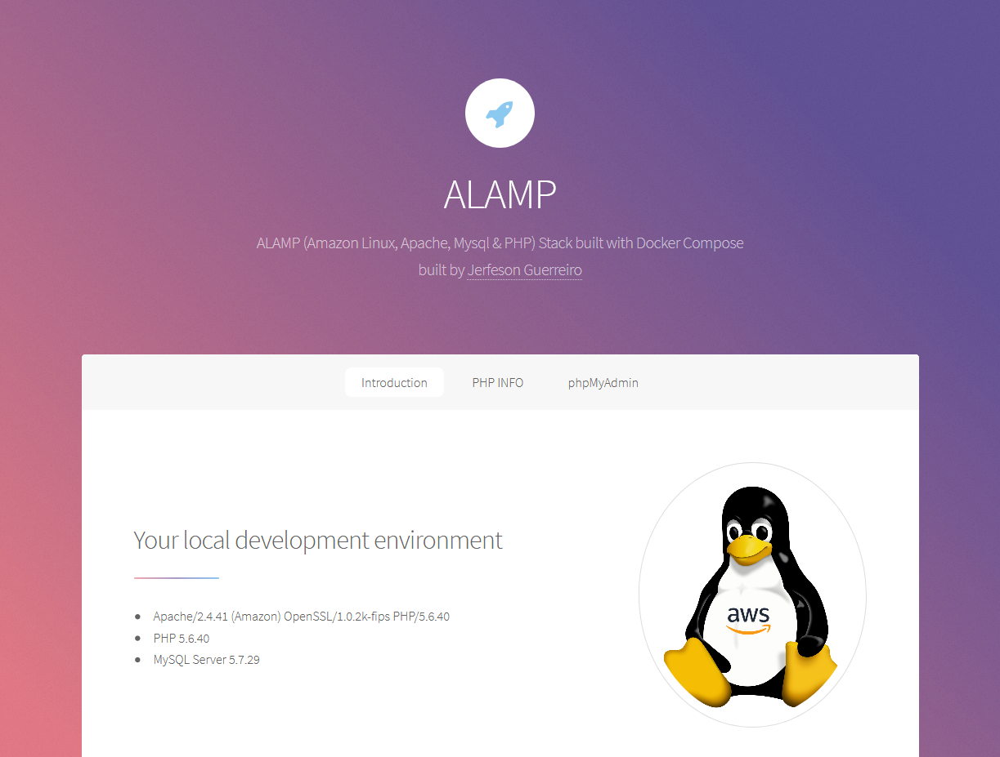

# ALAMP (Amazon Linux, Apache, Mysql & PHP) stack built with Docker Compose

This is a basic ALAMP stack environment built using Docker Compose. It consists following:

- PHP 5.6.X (More later)
- Apache 2.4
- MySQL 5.7
- phpMyAdmin
- Redis

## Use appropriate branch as per your php version needed:

* [5.6.x](https://github.com/jerfeson/docker-compose-alamp/tree/5.6.x)

## Configuration and Usage

Please read from appropriate version branch.

## Contributing

welcome to discuss a bugs, features and ideas.

## License

jerfeson/docker-compose-alamp is release under the MIT license.